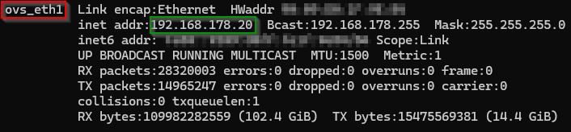

# Macvlan

The installation has been done on a Synology DS720 but sould work on any System using [Portainer](https://www.portainer.io/)

## Why Macvlan?

Macvlan allows you to structure your container network according to your preferences.

## Prerequisites

- [Portainer](https://www.portainer.io/)

Further Prerequisites you can find on [docker docs](https://docs.docker.com/network/network-tutorial-macvlan/#prerequisites).

## Installation Guide

Open your local Environment on Portainer and choose "Networks"

### Network Configuration

First you need to add a Network Configuration. That will be used in your [Creation](#network-creation) later. It sets the rules and boundaries for how the network will operate and is reusable.

So click on "Add network" and name it. Then select macvlan as Driver and Configuration as Macvlan Configuration.


To find out your Parent network card you should connect to your system which is running Portainer with ssh and run

```
ifconfig
```

and hit Enter.

You should receive a list of elements. Search for your the ipaddress 



After that fill the IPV4 Network configurtion. For example:


Now select "Creat the network" and you can go on with the [Creation](#network-creation).

### Network Creation

Add a Network Configuration, select Creation and choose your Configuration.


Then select "Creat the network" and you're done.